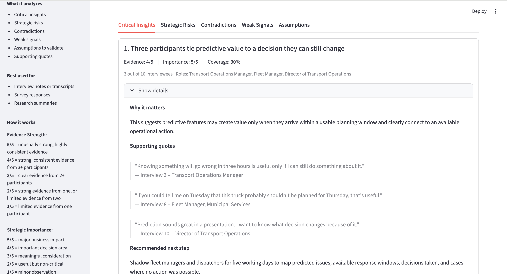
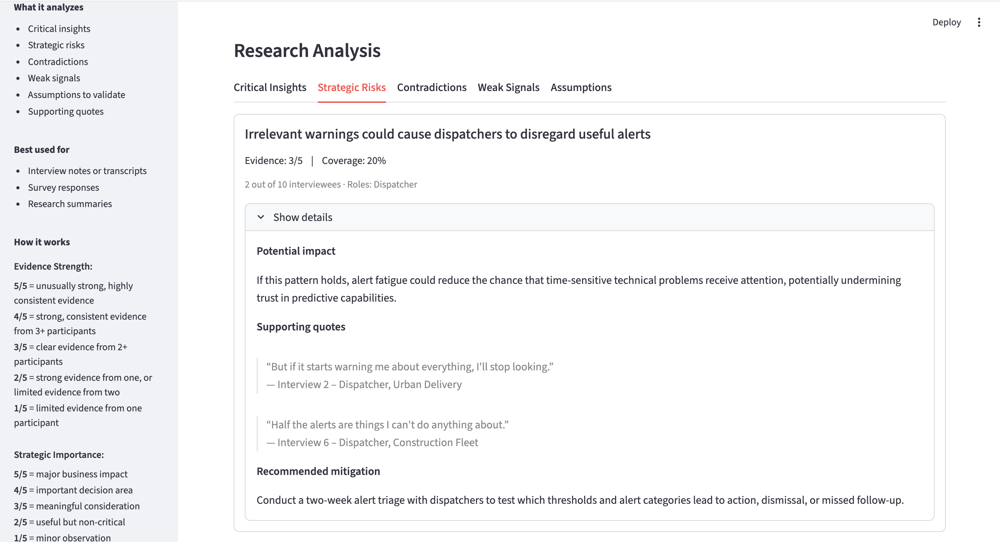
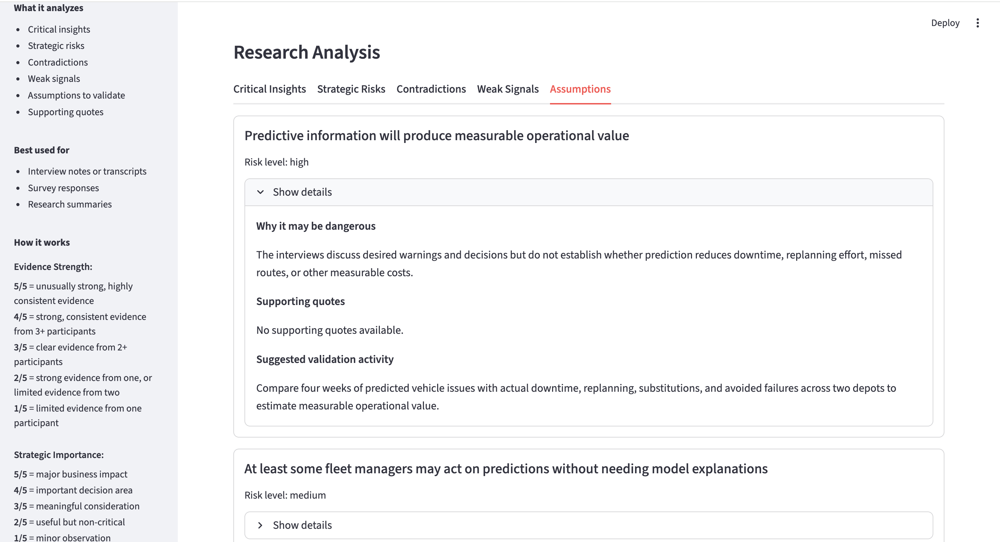

# Pattern

**Turn customer research into decisions.**

Pattern is an AI discovery synthesis tool I built to explore how AI could act as a second pair of eyes for product managers and researchers, without replacing the human judgment that makes discovery so valuable.

Paste in interview notes, transcripts, survey responses, or research summaries and Pattern will identify:

- Critical insights
- Strategic risks
- Contradictions
- Weak signals
- Assumptions requiring validation

## Why I built it

I’ve spent a lot of time manually synthesizing customer research and asking the same questions: Did we miss something? Are we giving too much weight to the loudest participants? Are we favoring evidence that supports what we already believe? Are we aware of the biases we’re bringing into the synthesis?

I wanted to explore whether AI could help challenge a team’s synthesis rather than simply summarize the research.

That led to the main principle behind Pattern:

**No quote, no insight.**

Evidence-based findings have to be traceable to the research. Assumptions are kept separate and explicitly framed as things that still need validation.

## What makes Pattern different

### Evidence over confident summaries

Findings stay connected to the quotes and interview sources behind them, so teams can inspect the evidence rather than simply trust an AI-generated conclusion.

### Frequency ≠ importance

Pattern scores each critical insight on a 1–5 scale for Evidence Strength and Strategic Importance, while showing Coverage separately. A lower-frequency finding can still rank highly when its implications are significant.

### Contradictions stay visible

Instead of smoothing conflicting evidence into one neat theme, Pattern surfaces genuine tensions between participants or user groups.

### Weak signals have somewhere to go

Potentially important observations aren’t discarded just because only 1 or 2 participants mentioned them. They’re separated from stronger patterns and treated with appropriate uncertainty.

### Discovery before solutions

Pattern recommends concrete research and validation next steps rather than jumping from an insight straight to “build a feature.”

## How it works

1. Paste customer research into Pattern.
2. Pattern analyzes it using a structured discovery synthesis framework.
3. Findings are scored from 1–5 on Evidence Strength and Strategic Importance, with Coverage shown separately. Pattern then ranks insights using those signals rather than frequency alone.
4. Supporting quotes and sources remain attached to the findings.
5. Pattern suggests what the team could investigate next.

I iterated on the synthesis logic because early outputs were often too generic, too confident, too focused on frequency, or sounded like consulting slides. The current framework is designed to keep the language closer to what participants actually said and the strength of the available evidence.

## Built with

- Python
- Streamlit
- OpenAI API
- Structured JSON outputs
- A custom discovery synthesis and scoring framework

I designed the product concept, synthesis framework, prompting logic, scoring approach, and interface, and built the working prototype.

## Sample data

Two sample interview datasets are included in `sample_data/` for testing.

## Current status

Pattern is an experimental prototype, not an autonomous decision-maker.

I see its role as supporting human synthesis: challenging conclusions, surfacing evidence that may have been overlooked, preserving contradictions, and helping teams decide what deserves another look.

## Example output

Pattern turns raw research into evidence-backed findings with traceable supporting quotes, coverage, and recommended next steps.

### Critical insights

### Strategic risks

### Assumptions to validate

